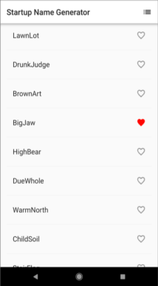

# DSC 2019
    -  첫번째 Flutter App Part1, 2: startup_namer 

  

## 학습목표: Flutter app 기본적인 시작점

### What you will learn
* Create the starter Flutter app
*  Use an external package
*  Add a Stateful widget
* Create an infinite scrolling ListView

useful resources:
- [Lab: Write your first Flutter app](https://flutter.dev/docs/get-started/codelab)
- [Cookbook: Useful Flutter samples](https://flutter.dev/docs/cookbook)

For help getting started with Flutter, view 
[online documentation](https://flutter.dev/docs), which offers tutorials,
samples, guidance on mobile development, and a full API reference.
