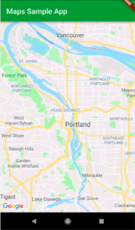

# Adding Google Maps to a Flutter app
 Google's mobile app SDK 

      
 

* Display a Google Map
* Retrieve map data from a web service
* Display this data as markers on the Map

- [Lab:# Adding Google Maps to a Flutter app](https://codelabs.developers.google.com/codelabs/google-maps-in-flutter/#0)
