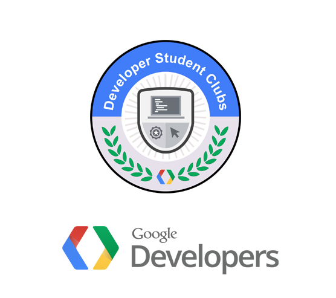
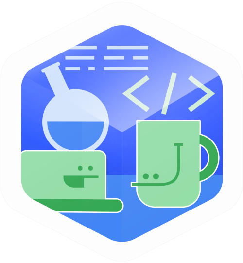

# DSC_Flutter

2019/2020 에서 DSC(Developer Student Club) 에서 진행했던  다뤘던 것을 바탕으로한 결과물입니다.

  

### Flutter 이용한 간단한 앱 
    - First Flutter App
    - Flutter Story App
    - Google Map
    - Business card
    - Xylophone

###  Study Jams 통합반 머신러닝 입문 : 
    - QWIKLABS Intro to ML: Language Processing
    

      
    

    - How Google does Machine Learning : [수료증](https://coursera.org/share/40532e067fe2446335b11909b5890d94)

### ML, DL 관련 블로그 운영(휴식기): https://back2black.tistory.com
    - 머신러닝 교과서 with 파이썬, 사이킷런, 텐서플로   , 세바스찬 라시카, 바히드 미자리리 저/박해선 역  
    - 밑바닥부터 시작하는 딥러닝: 파이썬으로 익히는 딥러닝 이론과 구현 : 파이썬으로 익히는 딥러닝 이론과 구현,  사이토 고키 저 / 개앞맵시 역

